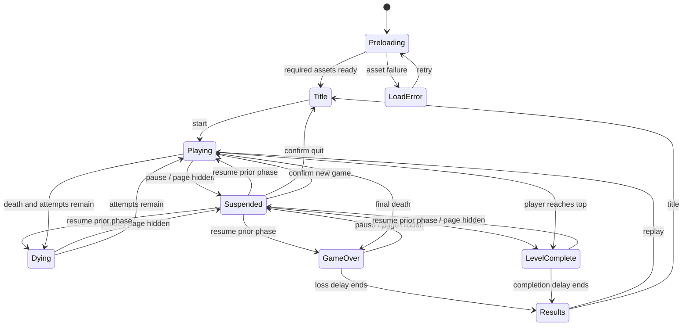

# Rooster Browser Port — First-Pass Specification

| Field | Value |
|---|---|
| Status | Proposed; ready for implementation after scope approval |
| Version | 0.2 |
| Date | 2026-10-08 |
| Recovery baseline | Git commit `5af4320` |
| First release | One-level browser vertical slice |

## 1. Purpose

Build a faithful, playable browser port of **Rooster** that validates the recovered gameplay, artwork, and architecture before the remaining levels and native mobile apps are attempted.

The first pass is deliberately one complete vertical slice: original title art, Level 1, keyboard and touch input, all Level 1 rules, pause, win/lose flow, replay, and local best-score persistence. The engine must be data-driven and platform-neutral enough that Levels 2–20 can be added without rewriting its rules.

This is a native web implementation, not an emulator and not a Java ME runtime in a browser.

## 2. Decision summary

| Area | Decision |
|---|---|
| Product slice | One fully playable Level 1 run |
| Visual fidelity | Use the recovered pixel art unchanged |
| Gameplay fidelity | Preserve recovered timing, movement, traffic, collision, pickups, attempts, and scoring |
| Browser UX | Normalize obsolete BlackBerry actions into keyboard, touch, and accessible on-screen controls |
| Runtime | Vanilla TypeScript and Canvas 2D |
| Build | Vite static build; no application server |
| Runtime dependencies | None unless an implementation constraint proves one necessary |
| Simulation | Deterministic fixed 60 ms ticks; rendering scheduled separately |
| Persistence | Versioned `localStorage` record for settings and best score |
| Test stack | Vitest for rules; Playwright for browser flows and visual checks |
| Native-port seam | Portable JSON game data plus seed-and-input conformance fixtures |

Canvas 2D is preferred over a game framework for this pass because the recovered game is a small 240×160 sprite engine with simple rectangle collisions, a bounded traffic pool, and about 212 KB of image assets. A framework can be reconsidered if the full port reveals requirements that this slice does not.

## 3. Requirements language and fidelity policy

“Must” is required for the first browser release. “Should” is preferred but may move to the next iteration if it does not affect the acceptance criteria. “May” is optional.

The implementation must distinguish:

- **Recovered behavior:** directly supported by the disassembly or extracted assets.
- **Browser normalization:** a deliberate replacement for obsolete device behavior.
- **Unknown behavior:** not safely inferable and therefore covered by an explicit product choice.

Recovered source files and extracted assets are forensic inputs. They must not be renamed, recolored, optimized in place, or otherwise modified. Corrections belong in game data or port code, with the original evidence retained.

Intentional browser normalizations in this specification are:

- Full suspension of every run phase while paused or hidden
- Tick-based transition timers instead of wall-clock comparisons
- Clamped player bounds
- One tick-owned pickup-animation cadence
- Death takes precedence over goal completion when both happen on one tick
- Pickups can be collected only by a visible player during Playing
- One consistent recovered-reset lane ordering for both first play and replay
- Rejected overlapping traffic candidates remain hidden instead of briefly exposing the original stationary pool-sprite bug
- Modern input, focus, and accessibility behavior
- A one-level Results screen in place of the original next-level screen

## 4. Goals and success definition

### 4.1 Goals

- Recreate the feel and rules of the BlackBerry game rather than merely its appearance.
- Let a player start, win, lose, pause, and replay Level 1 with either keyboard or touch.
- Display the original art sharply at modern screen sizes and aspect ratios.
- Keep game rules free of browser APIs so they can become the behavioral reference for later iOS and Android ports.
- Make random behavior repeatable in automated tests.
- Produce a static deployment that can be hosted on any ordinary HTTPS-capable file host.

### 4.2 The first pass is successful when

- A new player can reach active gameplay from the title screen without instructions from a developer.
- Level 1 can be completed and can reach game over through all recovered rule paths.
- Known mechanics match the contract in this document.
- Keyboard-only and touch-only runs are both possible.
- Hiding or pausing the page cannot silently advance the run.
- Reloading retains the best score and settings.
- The production build loads without missing assets or console errors in the supported browser matrix.
- A deterministic seed plus the same input timeline produces the same final state.

## 5. Scope

### 5.1 Included

- Asset preload and validation
- Original splash/title presentation
- Level 1 background and world generation
- Rooster movement and animation
- Camera behavior
- Traffic spawning, motion, recycling, and collision
- Solid random obstacles
- Gray, orange, and purple pickups
- HUD score, remaining traffic counter, and spare lives
- Death, respawn, and baseline three-attempt flow, extendable by gray pickups
- Level completion and scoring
- Pause/resume
- Replay and return-to-title actions
- Keyboard input
- Touch D-pad and on-screen actions
- Optional supported-device vibration with a setting
- Local best score
- Responsive, pixel-sharp presentation
- Deterministic unit, conformance, browser, and visual tests

### 5.2 Deferred

- Levels 2–20 and their progression screens
- Finale and credits sequence
- Original ten-entry initials leaderboard
- About screen
- Key-remapping UI
- Hidden cheats and debug key sequences
- Gamepad input
- Music or sound effects; none were recovered
- Installable PWA/offline packaging
- Online accounts, telemetry, cloud saves, or global leaderboards
- Redrawn or “HD” replacement art
- Native iOS or Android shells

### 5.3 Explicit non-goals

- Running the original COD files in an emulator
- Pixel-matching BlackBerry operating-system menus
- Preserving obsolete “Hide” or “Close application” commands
- Sharing a single executable binary among web, iOS, and Android
- Fixing every oddity of the original 20-level data before Level 1 parity is proven

## 6. User experience

### 6.1 First-pass state flow



`Playing` in this diagram includes short pickup notifications. `Dying` and `LevelComplete` are simulation states, not separate document pages. `Suspended` stores and restores the exact prior run phase; it is not a replacement phase.

### 6.2 Screen contracts

#### Preloading

- Preload every asset required by Title and Level 1 before Start becomes available.
- Show the recovered loader frame and progress fill, or an accessible equivalent using those assets.
- Expose a short DOM status such as “Loading 8 of 12.”
- On failure, identify that an asset could not load and offer Retry. Do not enter gameplay with placeholders.
- On LoadError, move focus to Retry; after activation, keep focus on the loading status until Title is ready.

#### Title

- Present `splash_1_3.png` in the 240×160 scene.
- Recreate the blinking “Press Space to Play” prompt using the recovered prompt image.
- Start with Space, Enter, pointer tap on the scene, or a visible Start button.
- The DOM Start control must be keyboard-focusable and have an accessible name.
- When Title first opens, move focus to Start.
- Provide a small labeled Vibration toggle outside the canvas. It defaults on, matching “Death Buzz,” but is best effort on the web.
- Do not expose deferred High Scores, Settings, or About destinations in this pass.

#### Gameplay

- The canvas owns the visual game scene.
- A compact control region outside the canvas owns Pause and the touch D-pad.
- DOM controls must not obscure the 240×160 logical scene.
- The HUD remains inside the logical scene and uses recovered HUD and digit sprites.

#### Pause

- Freeze the exact current game scene and draw a pause treatment over it.
- Provide Resume, New Game, Quit to Title, and the same Vibration toggle as Title.
- New Game and Quit to Title must open a semantic confirmation dialog. Cancel or Escape returns to Pause; confirm New Game creates a fresh run, and confirm Quit returns to Title.
- No game timers, animations, randomness, or input queues may advance while paused.
- On entry, move focus to Resume. On resume, restore focus to the game wrapper. On dialog close, restore focus to the invoking button.

#### Game over

- Display the recovered “YOU LOSE” treatment for 50 simulation ticks, exactly 3,000 ms.
- The original used a strict wall-clock comparison after 3,000 ms. The 50-tick timer is an intentional deterministic browser normalization and freezes when suspended.
- After the delay, emit a finalized loss result and enter the non-simulating Results route.
- Update the stored best score if the finalized run qualifies.

#### Level complete and results

- Display the recovered “LEVEL COMPLETED” treatment for 50 simulation ticks, exactly 3,000 ms.
- The original used a strict wall-clock comparison after 3,000 ms. The 50-tick timer is an intentional deterministic browser normalization and freezes when suspended.
- Add the remaining traffic counter to the cumulative score after the delay.
- Update the stored best score after applying the completion score.
- Since Levels 2–20 are outside this pass, show a simple results overlay with Score, Best, Replay, and Title instead of pretending the next level exists.
- This replacement is a browser-slice decision, not recovered original behavior.
- Move DOM focus to Replay when Results opens.
- Results is static: traffic, animation, timers, and RNG no longer advance. Enter/Space may activate Replay when Replay owns focus.

### 6.3 Input map

| Action | Keyboard | Touch/pointer |
|---|---|---|
| Start/confirm | Enter or Space | Start button or scene tap |
| Move up | Arrow Up or W | Hold or slide to D-pad Up |
| Move right | Arrow Right or D | Hold or slide to D-pad Right |
| Move down | Arrow Down or S | Hold or slide to D-pad Down |
| Move left | Arrow Left or A | Hold or slide to D-pad Left |
| Pause/resume | Escape or P | Pause/Resume button |
| Replay/confirm | Enter or Space | Labeled button |
| Back/cancel | Escape | Labeled Back/Title button |

The recovered W/L/S/K mapping is retained as undocumented “classic” aliases: W up, L right, S down, K left.

Input requirements:

- Movement continues while a direction is held.
- Movement is cardinal only; simultaneous keys must never produce diagonal speed.
- Track each keyboard key and pointer ID as a distinct active input source. If multiple directions are held, the most recently pressed source wins; releasing it falls back to the next-most-recent source still held.
- Pointer controls must use Pointer Events and pointer capture so held input does not stick when a finger leaves the D-pad.
- A held pointer may slide between D-pad directions without lifting. A small circular center dead zone suppresses accidental activation before the first direction is engaged. Once engaged, the current direction stays latched while crossing that dead zone and switches on entering another directional sector, so crossing the center never pauses movement. Leaving the D-pad releases movement while retaining capture so directional re-entry can resume it.
- Release a source on `keyup`, `pointerup`, `pointercancel`, `lostpointercapture`, window blur, visibility loss, or removal/disablement of its control.
- Each touch target must be at least 44×44 CSS pixels.
- The D-pad must be four named semantic buttons inside a group labeled “Movement controls.”
- Use `touch-action: none` only on the D-pad surface and other controls that require held pointer input.
- Keyboard capture is active only while the run route owns focus and the event target is not a form control. Prevent default browser behavior only for mapped game keys in that state.
- The game wrapper must have `tabindex="0"`. Start, Replay, confirmed New Game, and Resume move focus to it before simulation begins.
- Escape/P pause and resume globally while a run exists unless focus is inside a text-entry control. They must work when a Pause-menu button owns focus.
- While a run is active, focus loss, `visibilitychange`, or page backgrounding must enter Suspended and clear held inputs.

## 7. Recovered gameplay contract

### 7.1 Coordinate and timing model

- Logical viewport: **240×160 pixels**.
- World origin: top-left; X grows right and Y grows down.
- World width: 240 pixels.
- Tile-row height: 15 pixels.
- Level world height: `rowCount × 15`.
- Simulation cadence: one fixed update every **60 ms** (approximately 16.67 ticks per second).
- Rendering may run at display refresh rate, but it must show completed integer simulation states. No visual interpolation is required.
- Gameplay timing must use simulation ticks, never render-frame counts or wall-clock time.

### 7.2 Level 1 data

| Property | Level 1 value |
|---|---|
| Display number | 1 |
| Tile rows, top to bottom | `[4, 4, 1, 3, 4, 4, 1, 3, 4, 4, 4]` |
| Row count / world size | 11 rows / 240×165 |
| Lane speeds, top to bottom | `[0, 0, 1, -3, 0, 0, 3, -1, 0, 0, 0]` |
| Traffic spawn chance | 6% per simulation tick |
| Obstacle placement attempts | 20 |
| Initial traffic counter | 60 |
| Obstacles drawn above actors | Yes |
| Background atlas | `level1Background.png` |
| Player atlas | `rooster.png` |
| Dead-player image | `deadRooster.png` |
| Traffic atlas | `cars_1.png` |
| Obstacle atlas | `obstacles_grass1.png` |
| HUD digits | Black |

All values must live in versioned data rather than being embedded in rendering or screen code.

### 7.3 Player

- Sprite size: 25×25.
- Collision core, relative to the sprite: `x + 10, y + 10, width 5, height 5`.
- Spawn: `x = 120` and `y = worldHeight - 25`.
- Normal speed: 2 logical pixels per simulation tick.
- Orange-pickup speed: 4 logical pixels per simulation tick.
- Movement uses one cardinal direction per tick.
- Apply movement first. If the resulting collision core overlaps a solid obstacle, undo that complete movement.
- Clamp the sprite to the playable world bounds. This intentionally removes the original’s possible overshoot of up to one pixel at normal speed and three pixels while boosted.
- Win when the player sprite’s Y coordinate is less than or equal to zero.

Animation should follow the recovered directional frame sequences. Animation cadence must be tick-based and must not change when the display refresh rate changes.

### 7.4 Camera

- Start at `cameraY = max(0, worldHeight - 160)`.
- During active play, set `cameraY = playerY - 80` only when both strict conditions `playerY - 80 > 0` and `playerY + 80 < worldHeight` hold.
- When either strict condition fails, retain the previous `cameraY` instead of clamping it again. Level 1 can therefore finish with a small positive camera offset, matching the recovered hold behavior.
- During respawn, pan back toward the starting camera position at 4 logical pixels per tick before restoring player control.
- Level 1 is only five pixels taller than the viewport, but the general rule must support later, taller levels.

### 7.5 Traffic and the HUD counter

The counter is **not a clock**. It represents a remaining budget of successfully spawned vehicles.

On each traffic update, including Dying and timed terminal overlays:

1. Consume `randomInt(100)` from the traffic stream and compare it with the level’s traffic density.
2. If the roll succeeds and the inactive pool is nonempty, consume `randomInt(trafficLaneCount)` and select from a bottom-to-top list of nonzero-speed lanes. A failed density roll or an empty inactive pool consumes no lane roll.
3. Positive-speed traffic begins at `x = -vehicleWidth` and moves right. Negative-speed traffic begins at `x = 240` and moves left.
4. Reject a spawn that overlaps an active vehicle at its entry position.
5. Only a successful spawn during Playing decrements the HUD counter by one.
6. Recycle a vehicle after it has fully left the viewport.

Additional requirements:

- The active-traffic pool must support the recovered limit of 70 sprites.
- Assign the pool’s vehicle frames when the pool is built, cycling through the recovered traffic crops. A spawn takes the FIFO inactive-pool head; it does not randomly choose a frame.
- Use the recovered reset ordering consistently for first play and replay: build the selectable nonzero-speed lane list bottom-to-top and process active movement in the resulting reverse order, top-to-bottom. The original constructor used the opposite ordering only for the very first object construction; eliminating that first-run/replay discrepancy is an intentional deterministic normalization.
- A rejected overlapping spawn consumes its chance and lane rolls, remains hidden/nonrendered, and leaves the same vehicle at the FIFO head for the next attempt. The original made the pooled sprite visible before rejection and could leave a stationary, non-collidable entry sprite; this visual bug is intentionally removed.
- Process active movement by lane from top to bottom and within a lane from newest to oldest. Append recycled vehicles to the inactive FIFO tail in that processing order.
- Before player control begins, run exactly 240 traffic updates to pre-populate and advance the roadway. Discard their successful-spawn return values, then set the visible traffic counter to 60. This warm-up consumes the traffic RNG stream.
- A newly spawned vehicle moves once during the same update in which it spawns.
- Vehicle sprites are 18 pixels high.
- Vehicle collision rectangle: `x + 1, y + 1, width - 3, height - 7`.
- Player-to-vehicle overlap is lethal. Inclusive edge contact should count as an overlap, matching the recovered comparison.
- If the HUD counter reaches zero, trigger the same death flow as a traffic collision.
- Traffic continues to move and may spawn during Dying, LevelComplete, and the timed GameOver overlay, matching the recovered game; the HUD counter does not decrement during those phases.

### 7.6 Obstacles

- Perform 20 Level 1 placement attempts when the level is created.
- Only rows whose lane speed is zero may receive obstacles.
- Construct the eligible-row list by scanning rows from bottom to top.
- Allow at most 10 placed obstacles per row.
- In the bottom two start rows, reject X positions 101 through 139 to preserve the recovered central start corridor.
- Generate X as an inclusive integer from 0 through 239. The original permits an obstacle sprite to extend beyond the right world edge.
- For a chosen row, generate Y from `row × 15 - 6` through `row × 15 - 1` inclusive.
- Cycle obstacle types in the recovered `1, 2, 0` sequence rather than selecting a type randomly.
- Every placement attempt consumes exactly three obstacle-stream calls in this order: eligible-row index, X, then Y offset. Consume all three even if the row is full or the start-corridor rule rejects the attempt.
- Advance the obstacle-type cycle only after a successful placement.
- Preserve the recovered random placement behavior even though it does not guarantee non-overlap or path solvability.
- Small-obstacle collision rectangle: relative `(3, 3, 8, 8)`.
- Large 30×30-obstacle collision rectangle: relative `(9, 6, 11, 13)`.
- Obstacle contact is solid and nonlethal; undo the player’s attempted movement.

### 7.7 Pickups

Roll independently when a new Level 1 run is created. There may be at most one of each pickup.

| Asset/color | Presence chance | Effect | Message |
|---|---:|---|---|
| `cone_grey.png` | 25% | Add one spare life; no cap | “Free Bird” |
| `cone_orange.png` | 30% | Set player speed to 4 | “Speed x2” |
| `cone_purple.png` | 50% | Add an inclusive random 10–20 to the traffic counter | “Countdown +NN” |

- Each pickup is a 15×15 animated sprite.
- Random position: X 20–219 and Y 15 through `worldHeight - 16`.
- When a purple pickup is present, generate and store its inclusive 10–20 bonus immediately after its X and Y during level initialization. Collection reads that stored value and consumes no RNG.
- Do not add lane, obstacle, overlap, or reachability validation that the recovered game did not perform.
- A pickup is consumed once and remains consumed after a death.
- Speed boost ends on death or level transition.
- Pickup messages rise and expire after 20 ticks; they must not affect simulation.
- Advance each active pickup animation twice per 60 ms simulation tick, matching the recovered update-plus-paint cadence, but never mutate animation state from the renderer.

### 7.8 Death, attempts, and reset

- The run begins with two **spare lives**, which means three total attempts including the current one.
- Display the spare-life value in the HUD.
- On death, decrement spares `2 → 1 → 0 → -1`.
- `-1` means game over.
- Render the HUD spare-life value as `max(0, spareLives)`, so the internal `-1` sentinel is never displayed.
- Place the theme’s dead-player image at the collision position and hide the live player.
- Keep each dead-player marker in the world; multiple deaths accumulate markers until replay or level reset clears the level.
- When attempts remain, hold the death phase for 15 ticks, approximately 900 ms, then pan toward the starting camera position.
- If vibration is enabled and supported, request a 500 ms vibration. Failure or lack of API support must be silent.
- Reset the traffic counter to 60 immediately on every death, including the final death.
- A counter-zero death with attempts remaining shows the recovered “COUNT HIT 0!!!” overlay. On the final death, “YOU LOSE” takes precedence.
- When attempts remain, return the camera to the start and reset the player position and speed.
- Keep score unchanged and keep already consumed pickups consumed.
- Keep active traffic and placed obstacles in their current state across respawn.
- Clear held input before control resumes.

### 7.9 Completion and score

- Reaching `player.y <= 0` immediately stops player control and enters LevelComplete.
- Show the completion overlay for 50 simulation ticks, exactly 3,000 ms. This is the deterministic browser normalization described in Section 6.2.
- After the delay, add the current remaining traffic counter to cumulative score.
- Do not award points for distance, time, vehicles crossed, pickups, or collisions.
- The first-pass result is the final Level 1 score because later levels are not yet included.

### 7.10 Randomness

- Production runs receive a fresh nonzero unsigned 32-bit `runSeed` from `crypto.getRandomValues` in the browser adapter.
- Derive three independent nonzero streams by XORing `runSeed` with these constants: traffic `0xA341316C`, obstacles `0xC8013EA4`, and pickups `0xAD90777D`. If a result is zero, replace it with `0x6D2B79F5`.
- Every stream uses xorshift32 with unsigned 32-bit overflow:

```text
x ^= x << 13
x ^= x >>> 17
x ^= x << 5
state = x >>> 0
```

- `randomInt(maxExclusive)` is `floor(nextU32() / 4294967296 × maxExclusive)`.
- A percentage succeeds when `randomInt(100) < percentage`.
- The rules core owns all three RNG states and must never call `Math.random()`.
- Tests and debug builds must accept an explicit `runSeed`.
- Include the initial seed in diagnostic output so a reported run can be reproduced.
- Cosmetic behavior must not consume any gameplay RNG stream.

Run initialization consumes randomness in this order:

1. Derive the three RNG streams.
2. Generate obstacles using only the obstacle stream.
3. Build the traffic pool and perform its 240-update warm-up using only the traffic stream.
4. Process gray, orange, then purple in order. For each pickup, roll presence and, only when present, immediately consume X then Y from the pickup stream before rolling the next pickup.
5. If purple is present, immediately consume `randomInt(11) + 10` after its Y and store that bonus in purple pickup state.

The original used separate unseeded `java.util.Random` instances. The specified algorithms and seed derivation are intentional, portable normalizations that make browser and later native implementations reproducible without coupling unrelated systems.

### 7.11 Authoritative simulation order

For each non-suspended run tick:

1. Snapshot and resolve input sources for this tick.
2. Advance active pickup animation twice. In Playing, test a visible player against all pickups in gray, purple, then orange order; collect every overlap and enqueue events in that order.
3. In Playing, move the visible player once and fully roll back that move if it overlaps an obstacle.
4. Advance traffic once: attempt at most one spawn, then move every active vehicle, including a vehicle just spawned.
5. In Playing only, decrement the traffic counter if step 4 spawned a vehicle successfully.
6. In Playing, resolve lethality before completion. If the counter is zero, use cause `counterZero`; otherwise, if traffic overlaps the player, use cause `traffic`. If both occur, `counterZero` controls the message.
7. On death, append the dead marker, hide the player, decrement spare lives, reset the counter immediately, clear held input, and enter Dying or GameOver.
8. If no death occurred, test `player.y <= 0` and enter LevelComplete. This deliberate death-first rule removes a recovered edge case in which a lethal goal tick could also complete the level and award the newly reset counter.
9. Advance the current phase timer or Dying camera return as applicable. Traffic continues in Dying, LevelComplete, and timed GameOver, but their successful spawns do not change the counter. A phase entered during this tick starts with elapsed ticks at zero; its first elapsed tick is the next non-suspended step.
10. Update the camera, pickup-message positions, and tick-owned animation counters.
11. Increment the run tick once and emit the ordered event list.

Rendering, storage, haptics, and DOM updates occur only after `step` returns and cannot mutate rule state.

Dying completes after 15 subsequent elapsed ticks. LevelComplete and GameOver complete after 50 subsequent elapsed ticks. Completion finalizes the score before emitting `scoreFinalized`; GameOver finalizes the current score unchanged. Either terminal phase then enters static Results, where `step` performs no gameplay or RNG work.

## 8. Rendering and layout contract

### 8.1 Canvas presentation

- Render the game into a 240×160 logical buffer.
- Present it at a 3:2 aspect ratio, centered with letterboxing as needed.
- Prefer integer scaling when it does not leave substantial playable width unused.
- On narrow portrait screens, allow a fractional fit that fills the available width rather
  than holding the canvas to 240 CSS pixels or cropping it. Preserve the compact integer
  scale in narrow, short landscape layouts so touch controls remain reachable.
- Disable image smoothing for every relevant 2D context.
- Use `image-rendering: pixelated` on the presentation canvas.
- Account for device pixel ratio without changing logical coordinates.
- Never stretch width and height independently.

### 8.2 Layer order

Render in this order:

1. Tiled background
2. Obstacles configured below actors
3. Dead-player/effect sprites
4. Pickup sprites
5. Live player
6. Traffic
7. Obstacles configured above actors
8. HUD
9. Pickup messages
10. Pause, count-zero, completion, loss, or results overlay

Level 1 uses above-actor obstacles.

Suppress the pickup-message layer entirely while a count-zero, completion, or loss overlay is active, matching the recovered early-return rendering path. Pause and Results simply draw above the last applicable scene.

### 8.3 Responsive composition

- Portrait: game scene centered above a touch D-pad and action row.
- Landscape: game scene centered; controls may sit alongside it only if the scene remains at least 240×160 CSS pixels and safe-area insets are respected.
- Present the D-pad as one connected physical cross. Its pressed arm and center pivot must visibly follow the currently engaged pointer direction without relying on color alone.
- Keyboard users must be able to hide or ignore touch controls without losing Pause/Resume access.
- Rotation or resizing must not reset the run, alter world coordinates, or consume an input.

### 8.4 Accessibility

- Use semantic DOM buttons for Start, Pause, Resume, Replay, New Game, and Title.
- Use semantic, named buttons for every D-pad direction.
- Keep a visible focus indicator.
- Provide a persistent DOM status mirror for objective, score, spare lives, traffic remaining, and best score. Routine value changes must not be live-announced every tick.
- Use a restrained polite live region for pickup collection, death, pause, completion, and game over.
- Do not require color alone to identify any action.
- All three differently colored cones are beneficial and require no player choice. A short Controls/How to Play disclosure must name each cone and its effect, and pickup announcements must state the effect rather than color alone.
- Draw a small outlined non-color marker above each active cone without altering its recovered sprite: a life/heart mark for gray, double chevrons for orange speed, and a plus mark for purple counter. The markers are presentation-only and do not participate in collision.
- Respect `prefers-reduced-motion` for non-gameplay UI movement; core gameplay timing remains unchanged.
- When `prefers-reduced-motion: reduce` is active, make prompt blinking and results motion static. No saved override is included in this pass.
- Canvas has a short accessible label; interactive actions remain real DOM elements rather than canvas-only hit regions.
- Keep browser zoom enabled. At narrow widths or 400% zoom, reflow the page and allow document scrolling outside held-input controls rather than clipping content.
- Fully nonvisual completion of this real-time spatial game is not an acceptance target for the first pass. Menus, controls, objective, and changing status must nevertheless be perceivable and operable outside the canvas.

## 9. Asset contract

`recovered/assets/manifest.json` is the canonical inventory:

- 48 named resources: 47 PNG files and one GIF
- One additional embedded/unreferenced 36×36 PNG
- No recovered audio or music signatures

First-pass code should explicitly import the required original files from `recovered/assets/img`. Vite may fingerprint and copy those imports into the production bundle. Do not maintain hand-copied “web versions” of the same files.

An asset catalog must map stable semantic IDs, such as `player.rooster` or `traffic.cars`, to imported URLs and atlas metadata. Rules and level data refer to IDs, never browser paths.

At build or test time:

- Validate that every referenced file exists.
- Validate expected dimensions.
- Validate checksums from the recovered manifest where available.
- Fail early on a missing or changed forensic asset.

The implementation may crop sprite sheets at runtime. It must not rewrite the original sheets.

## 10. Technical architecture

### 10.1 Stack

- TypeScript with strict checking
- Browser Canvas 2D
- Vite development server and static production build
- Vitest unit and conformance tests
- Playwright end-to-end and screenshot tests
- CSS for responsive composition and controls
- No runtime UI or game-engine framework in the first pass

### 10.2 Separation of concerns

The deterministic rules core must not import or reference:

- `window` or `document`
- Canvas types
- `localStorage`
- `navigator`
- `Date`, `performance`, or wall-clock timers
- `Math.random()`

Browser adapters provide rendering, input, storage, haptics, and clock scheduling.

The central rule operation is conceptually:

```ts
step(state: GameState, input: InputSnapshot): {
  state: GameState;
  events: GameEvent[];
}
```

Events such as `playerDied`, `pickupCollected`, `levelCompleted`, or `scoreFinalized` let the browser layer trigger haptics and UI without placing platform effects in the rules. The storage adapter compares `scoreFinalized` with the persisted best and owns any `bestScoreChanged` UI notification; best score is not rules state.

### 10.3 State model

At minimum, serializable game state contains:

```ts
interface GameState {
  version: 1;
  route: "title" | "run" | "results" | "loadError";
  phase: "playing" | "dying" | "levelComplete" | "gameOver" | null;
  suspension: null | {
    reason: "user" | "hidden" | "blur";
    resumePhase: "playing" | "dying" | "levelComplete" | "gameOver";
  };
  tick: number;
  levelId: string;
  runSeed: number;
  rngStates: {
    traffic: number;
    obstacles: number;
    pickups: number;
  };
  player: PlayerState;
  traffic: TrafficState[];
  obstacles: ObstacleState[];
  pickups: PickupState[];
  spareLives: number;
  trafficRemaining: number;
  score: number;
  cameraY: number;
  timers: TransitionTimers;
  result: null | {
    outcome: "win" | "loss";
    finalScore: number;
  };
}
```

The active run is not persisted in the first pass, but serializable state is required for tests, diagnostics, and later save-state work.

### 10.4 Repository shape

```text
browser-port/
  game-data/
    v1/
      levels.json
      atlases.json
      schema.json
      evidence.json
  index.html
  package.json
  vite.config.ts
  src/
    main.ts
    app/
      status-view.ts
    core/
      engine.ts
      types.ts
      initialization.ts
      input.ts
      rng.ts
      systems/
        movement.ts
        traffic.ts
        obstacles.ts
        pickups.ts
    data/
      assets.ts
      index.ts
      types.ts
      validate.ts
    render/
      canvas-renderer.ts
      asset-loader.ts
    platform/
      browser-clock.ts
      browser-input.ts
      browser-storage.ts
      browser-haptics.ts
    screens/
      screen-view.ts
    styles/
      game.css
  test/
    unit/
    fixtures/
    e2e/
```

Names may change, but the boundaries may not collapse without updating this specification.

All package commands in this version run from `browser-port/` or through the equivalent `npm --prefix browser-port ...` form. Commit the generated lockfile and pin resolvable dependency versions.

Because `browser-port/` imports immutable inputs from the sibling `recovered/assets/` directory, `vite.config.ts` must narrowly allow the browser-port root and that resolved asset directory through `server.fs.allow`. Do not allow the entire repository root. Production builds must follow the same explicit-import asset graph. Versioned game data lives inside `browser-port/game-data/v1/` so it remains portable with the implementation.

Set Vite’s production `base` to a relative or deployment-configurable value. The release test must serve the built output from a non-root path such as `/rooster/` and verify that HTML, modules, and images all load.

### 10.5 Main loop

Use `requestAnimationFrame` for presentation and a fixed accumulator for simulation:

```text
on animation frame:
  elapsed = clamp(now - previousFrame, 0, 240 ms)
  accumulator += elapsed
  steps = 0

  while accumulator >= 60 ms and steps < 4:
    { state, events } = step(state, currentInput)
    dispatch events to browser adapters in returned order
    accumulator -= 60 ms
    steps += 1

  if steps reached 4:
    discard excess accumulated time

  render(state)
  request the next animation frame
```

On page hide, focus loss, or explicit pause:

- Store the current run phase in `suspension.resumePhase` and suspend it.
- Clear the accumulator.
- Clear all held input.
- Record no simulated elapsed time.

This prevents a return from a background tab from causing a burst of traffic and deaths.

For a user-requested pause, Resume clears suspension immediately. For hidden/blur suspension, returning to the page shows the Pause UI and requires an explicit Resume so no run restarts under an unattended finger or key.

### 10.6 Portable game data

`game-data/v1` must use browser-independent identifiers and JSON-compatible primitives. It should contain:

- Level rows and signed lane speeds
- Density/count values
- Theme and atlas IDs
- Collision rectangles
- Drawing-order flag
- Sprite-sheet frame dimensions and frame groups
- Pickup probabilities and effects

Validate the data against a checked-in schema. Preserve original oddities in raw recovered values and handle incompatible extras explicitly. For example, the recovered Level 2 lane-speed list is longer than its tile-row list; consumers should ignore out-of-world rows rather than silently changing source data.

## 11. Persistence

Use one versioned key: `rooster.save.v1`.

First-pass payload:

```json
{
  "version": 1,
  "bestScore": 0,
  "settings": {
    "vibration": true
  }
}
```

Requirements:

- Validate type and range before using loaded values.
- Version 1 has no predecessor to migrate. Treat a missing, corrupt, or unsupported-version value as a fresh in-memory Version 1 record.
- Catch storage access and quota exceptions.
- Never prevent gameplay because persistence is unavailable.
- Do not persist the active run in this pass.
- Store no personal data, analytics ID, or network identifier.

Classic W/L/S/K aliases remain enabled in the first pass and are not a setting. Reduced-motion behavior follows the browser media query and is not persisted.

### 11.1 Canonical state serialization

Conformance fixtures serialize rules state as UTF-8 JSON with:

- Object keys sorted recursively in ascending Unicode code-point order
- Array order preserved
- Integer decimal numbers only
- No insignificant whitespace
- No undefined, non-finite, platform object, or wall-clock value

Fixtures check in the canonical final JSON and its lowercase SHA-256 hex digest. Implementations compare canonical JSON first; the digest is a compact reporting aid, not a substitute for inspectable expected state.

## 12. Testing strategy

### 12.1 Unit tests

Vitest must cover:

- Level-data/schema validation
- Fixed-step accumulator and catch-up cap
- Player movement, direction arbitration, and bounds
- Collision rectangle math, including edge contact
- Obstacle rollback
- Seeded RNG repeatability and integer ranges
- Traffic spawn success/rejection and recycling
- Counter decrement only on successful spawn
- Count-zero death
- All three pickup chances/effects using controlled RNG
- Death timer, reset, speed reset, and consumed-pickup retention
- Three-attempt lifecycle without a gray pickup and extended lifecycle after a gray pickup
- Win condition, 50-tick transition, and score award
- Pause and hidden-page zero-advance behavior
- Persistence unsupported-version, corruption, and unavailable-storage fallback

### 12.2 Conformance fixtures

Check in compact fixtures containing:

- Data version
- Initial state and RNG seed
- Input snapshot for each tick
- Expected important events
- Expected final-state hash or canonical JSON

At least one fixture must cover each death cause, each pickup, obstacle blocking, a successful completion, and a full game over. Include one fixture proving the 240-update traffic warm-up and one proving a gray pickup permits an additional attempt. Future Swift/Kotlin or shared-core implementations must pass the same fixtures.

### 12.3 Visual tests

Capture golden images at logical 240×160 for:

- Title prompt visible and hidden
- Level 1 initial state
- Mid-level camera state
- Pickup notice
- Death state
- Pause overlay
- Level complete
- Game over
- Results

Generate authoritative pixel goldens in Playwright Chromium with bundled or image-based text. Golden comparisons should mask only deliberately variable data such as a seed label; they should not use broad thresholds that hide sprite-position errors. Firefox and WebKit use structural/coordinate assertions plus targeted screenshots, not cross-engine pixel identity.

### 12.4 Browser tests

Playwright must exercise Chromium, Firefox, and WebKit with:

- Desktop keyboard flow
- Touch-emulated portrait flow
- Touch-emulated landscape/rotation flow
- Pause/resume
- Page visibility pause
- Win/replay
- Three-death game over under a seed with no gray pickup
- Reloaded best score
- Corrupt-storage recovery
- Failed-asset error presentation where practical
- Start/Resume/Replay focus transfer to the game wrapper
- LoadError, Pause, confirmation-dialog, and Results focus placement/restoration
- Named D-pad buttons and labeled movement group
- Status-mirror values and restrained live-region events
- Reduced-motion prompt/results behavior
- 400% zoom and narrow-width reflow without clipped actions
- Production output served successfully below `/rooster/`

Win and full-run tests must inject checked-in, solvable seeds. Faithful obstacle generation can create an awkward or potentially blocked random layout, so CI must not depend on an uncontrolled seed.

Perform at least one manual smoke test on a physical iPhone/iPad Safari device and one Android Chrome device before public release. On those devices, verify menu/control naming, focus order, and event announcements with VoiceOver and TalkBack respectively; fully nonvisual gameplay completion remains outside first-pass scope.

Support policy at release: current and previous major desktop Chrome/Edge, Firefox, and Safari; current iOS Safari; and current Android Chrome. Automated Playwright engines are the continuous proxy, while the physical-device smoke tests cover platform integration.

## 13. Acceptance criteria

### 13.1 Functional

- [ ] A cold load reaches Title with no missing required asset.
- [ ] Enter, Space, scene tap, and Start button can begin Level 1.
- [ ] Holding a direction for 10 unobstructed normal-speed ticks moves exactly 20 logical pixels.
- [ ] Opposing or multiple inputs never create diagonal or multiplied movement.
- [ ] A solid obstacle reverses the complete attempted movement and causes no death.
- [ ] Traffic moves at the signed Level 1 lane speeds.
- [ ] A new run performs exactly 240 traffic warm-up updates before control, then starts the visible counter at 60.
- [ ] The HUD traffic counter changes only after a successful vehicle spawn.
- [ ] Traffic collision causes exactly one death and does not double-decrement during the same contact.
- [ ] Counter zero causes the recovered count-zero death path.
- [ ] The HUD starts at two spare lives; without a gray pickup, the third death ends the run.
- [ ] Each collected gray pickup adds one spare life and therefore permits one additional death before game over.
- [ ] Respawn resets position, camera, speed, and counter while preserving score and consumed pickups.
- [ ] Respawn preserves existing traffic, obstacles, and prior dead-player markers.
- [ ] Gray, orange, and purple pickups apply the recovered effects.
- [ ] Every active pickup has the specified non-color marker, and its collected-effect announcement is understandable without color.
- [ ] Reaching Y ≤ 0 stops play, shows completion for 50 ticks, and awards the remaining counter.
- [ ] Pause and page hiding advance the simulation by zero ticks.
- [ ] A complete run is possible with keyboard only.
- [ ] A complete run is possible with touch only.
- [ ] A held D-pad pointer can cross the small center dead zone without pausing, switches on entering another directional sector, and stops on release or leaving the pad.
- [ ] Reload preserves best score and settings.
- [ ] Replay creates a fresh seed, level, attempts, score, traffic, obstacles, and pickups.

### 13.2 Visual and responsive

- [ ] The logical scene is always 240×160 and never stretched or cropped.
- [ ] Original sprites are sharp with image smoothing disabled.
- [ ] The recovered layer order is correct.
- [ ] HUD elements remain at recovered logical positions.
- [ ] Resizing and rotation preserve the current run.
- [ ] All touch controls remain outside the scene and meet the minimum target size.
- [ ] The D-pad exposes four named buttons in a labeled group.
- [ ] Focus is visible, moves as specified between screens/dialogs, and all actions are reachable as DOM controls.
- [ ] The status mirror exposes objective, score, spares, traffic remaining, and best score without announcing routine tick changes.
- [ ] Browser zoom remains enabled, and all actions remain reachable at 400% zoom.

### 13.3 Technical

- [ ] `npm --prefix browser-port run check` runs `tsc --noEmit` successfully.
- [ ] `npm --prefix browser-port run build` produces a self-contained static output.
- [ ] `npm --prefix browser-port test` passes unit and conformance tests.
- [ ] Playwright browser flows pass in the supported matrix.
- [ ] No rules-core module imports a browser API.
- [ ] Same data, seed, and input fixture produce byte-for-byte canonical final state.
- [ ] Production play emits no uncaught exception or console error.
- [ ] The built game loads all code and assets when served from a non-root `/rooster/` path.
- [ ] Total raw bytes for production HTML, CSS, JavaScript, and first-pass image assets are under 500 KB, excluding source maps and hosting headers.

## 14. Performance and reliability budgets

- Original recovered image payload: approximately 212 KB.
- First-load size target: less than 500 KB total raw production HTML, CSS, JavaScript, and first-pass image assets, excluding source maps.
- Rendering target: one presentation per available animation frame without changing simulation speed.
- Rules target: each 60 ms step completes well below 1 ms on a representative mid-range phone.
- Input-to-visible-response target: no more than one simulation tick under normal load.
- Maximum catch-up: four ticks; excess time is discarded.
- Background CPU target: no active simulation while hidden or paused.
- Network after initial load: none required for gameplay.

## 15. Delivery milestones

### Milestone 0 — Evidence lock

- Freeze the recovered asset manifest.
- Transcribe Level 1 and atlas metadata into validated JSON.
- Add an evidence map from each data field to recovered code/assets.
- Implement and verify the portable RNG specified in Section 7.10.

Exit: data validation and checksum tests pass.

### Milestone 1 — Browser shell

- Vite/TypeScript scaffold
- Asset preloader and error state
- 240×160 nearest-neighbor canvas
- Responsive layout
- Title and Start flow

Exit: Title works on desktop and touch viewport; production build is static.

### Milestone 2 — Movement and world

- Fixed-step loop
- Level 1 tile rendering
- Player movement/animation/collision core
- Camera
- Keyboard and touch D-pad

Exit: deterministic movement and obstacle fixtures pass.

### Milestone 3 — Complete rules

- Traffic
- Obstacles
- All pickups
- HUD
- Death/respawn/attempts
- Completion and scoring

Exit: Level 1 is winnable and can reach game over with recovered behavior.

### Milestone 4 — Product flow

- Pause/visibility handling
- Game-over and results actions
- Storage and best score
- Vibration adapter
- Accessibility pass

Exit: keyboard-only and touch-only acceptance runs pass.

### Milestone 5 — Release candidate

- Visual goldens
- Playwright matrix
- Physical iOS/Android smoke tests
- Performance and bundle checks
- Static-host deployment notes

Exit: every first-pass acceptance criterion is checked or has a documented waiver.

## 16. Expansion path

After Level 1 parity:

1. Add Levels 2–20 as data and theme/atlas content.
2. Restore next-level screens and complete multi-level score/life progression.
3. Restore the finale.
4. Decide whether to reproduce the ten-entry, three-initial local leaderboard.
5. Add About, controls/settings, and optional preservation-only debug features.
6. Reassess the mobile implementation using evidence from the stable browser core.

For mobile, this specification does not predetermine the technology. Reasonable later options are:

- Reuse TypeScript through a mobile rendering shell.
- Reimplement the deterministic core in Swift and Kotlin.
- Move the verified core into a shared systems language.

Whichever path is chosen, versioned JSON and conformance fixtures are the compatibility contract. The browser implementation is the first reference implementation, not permission to couple game rules to the DOM.

## 17. Risks and open product decisions

| Risk or decision | Current treatment |
|---|---|
| Decompiled code is not original source | Mark inferred behavior and lock it with tests |
| Random generation creates hard-to-repeat bugs | Store seed and use deterministic RNG |
| Java ME font metrics cannot be reproduced exactly | Prefer recovered image text; treat browser text as normalized UI |
| Browser vibration varies or is unavailable | Optional best-effort adapter; never a gameplay dependency |
| Local storage may be blocked | In-memory fallback |
| Public rights to redistribute original art/code may be unclear | Complete a rights review before public hosting or app-store submission |
| Exact original edge overshoot | Deliberately use clamped bounds |
| Full mobile sharing strategy is premature | Decide after browser parity and profiling |
| One-level slice replaces original Next Level behavior | Clearly label Results as first-pass product behavior |

## 18. Evidence map

Primary recovered references:

- [Recovery notes](../recovered/README.md)
- [Asset manifest](../recovered/assets/manifest.json)
- [Main loop and state router](../recovered/disassembly/com/plazmic/rooster/RoosterCanvas.java)
- [Level definitions](../recovered/disassembly/com/plazmic/rooster/LevelConfig.java)
- [World construction](../recovered/disassembly/com/plazmic/rooster/Levels.java)
- [Gameplay orchestration](../recovered/disassembly/com/plazmic/rooster/Game.java)
- [Player behavior](../recovered/disassembly/com/plazmic/rooster/Rooster.java)
- [Traffic behavior](../recovered/disassembly/com/plazmic/rooster/Traffic.java)
- [Obstacle behavior](../recovered/disassembly/com/plazmic/rooster/Forest.java)
- [HUD behavior](../recovered/disassembly/com/plazmic/rooster/HUD.java)
- [Original persistence](../recovered/disassembly/com/plazmic/rooster/Storage.java)

Web-platform references:

- [Vite guide](https://vite.dev/guide/)
- [Vite static asset handling](https://vite.dev/guide/assets)
- [MDN: Canvas API](https://developer.mozilla.org/en-US/docs/Web/API/Canvas_API)
- [MDN: requestAnimationFrame](https://developer.mozilla.org/en-US/docs/Web/API/Window/requestAnimationFrame)
- [MDN: Pointer Events](https://developer.mozilla.org/en-US/docs/Web/API/Pointer_events/Using_Pointer_Events)
- [MDN: localStorage](https://developer.mozilla.org/en-US/docs/Web/API/Window/localStorage)
- [Vitest guide](https://vitest.dev/guide/)
- [Playwright test documentation](https://playwright.dev/docs/writing-tests)

## 19. Definition of ready for implementation

Milestone 0 implementation may begin when:

- This first-pass scope is accepted.
- Any requested changes to included/deferred screens are reflected here.

The RNG, canonical serialization, Level 1 target, and browser normalizations are fixed by Version 0.2 of this specification. Milestone 1 begins after Milestone 0 has transcribed and validated the Level 1 data with evidence links.

Local-only development may proceed while rights are reviewed. Public hosting, beta distribution, and app-store submission remain blocked until the right to redistribute the recovered art and game content is cleared.
